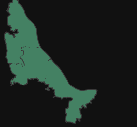

# # Geospatial_Interactive_Map
In this Git, I have done 1 Project But different variation. 
         (1) 1st_project
         (2) 1st_project_final

## 1st_project:
I visualized my 1st project not only static but also web map(interactive map).
My project image is below:

This is municipal_boundary