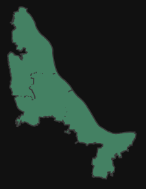
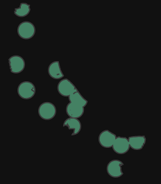
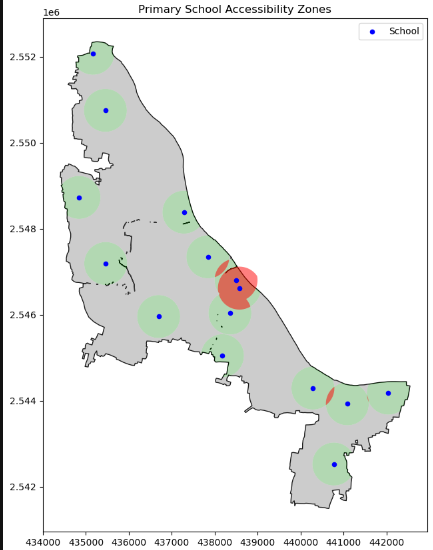
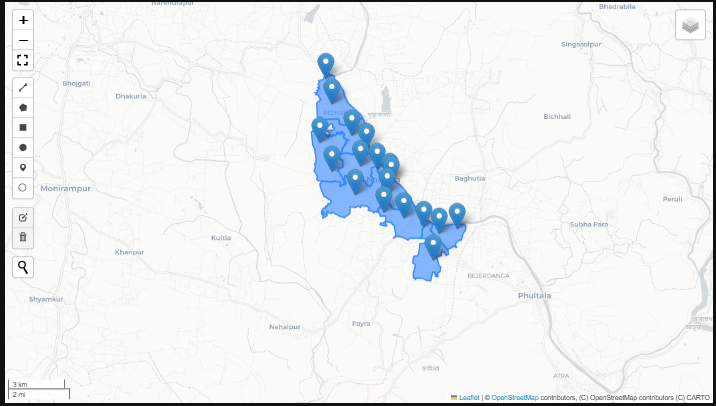
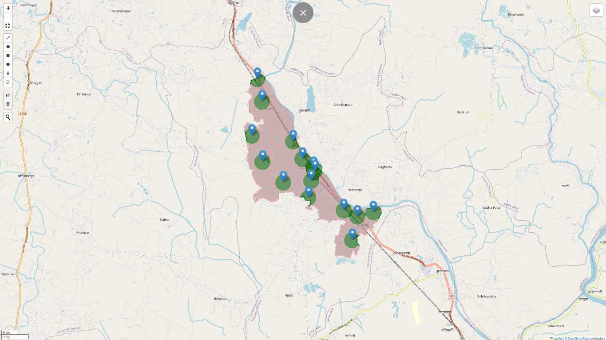

# # Geospatial_Interactive_Map
In this Git, I have done 1 Project But different variation. 
         (1) 1st_project
         (2) 1st_project_final

## 1st_project:
I visualized my 1st project not only static but also web map(interactive map).
My project image is below:

1st one-

This is municipal_boundary

2nd-

This is our Serve Area.

3rd- 

This is Overserve Area

4th- 

Now i am showing municipal_boundary with serve_Area, Overserve_Area, Underserve_Area.
But it is a static map

In web_Map(Interactive_map),is below- 

## 1st-project_final:
I am just showing web_map
